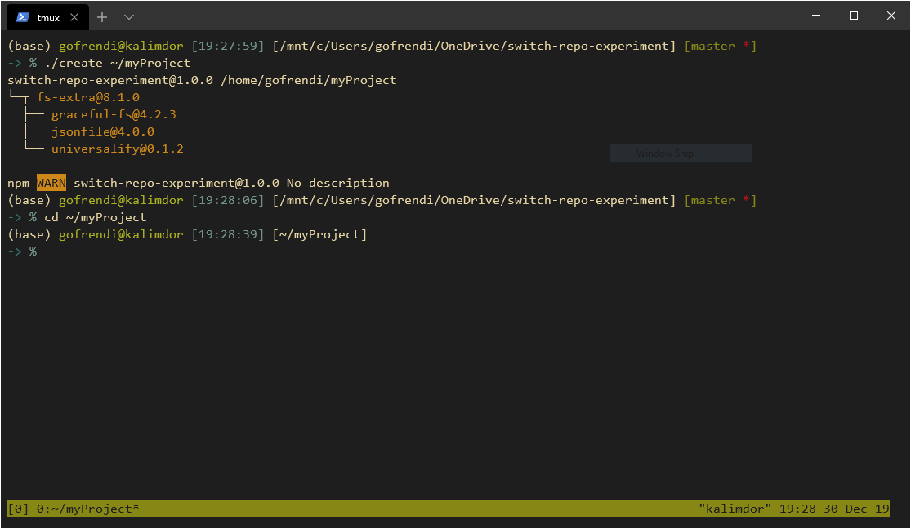
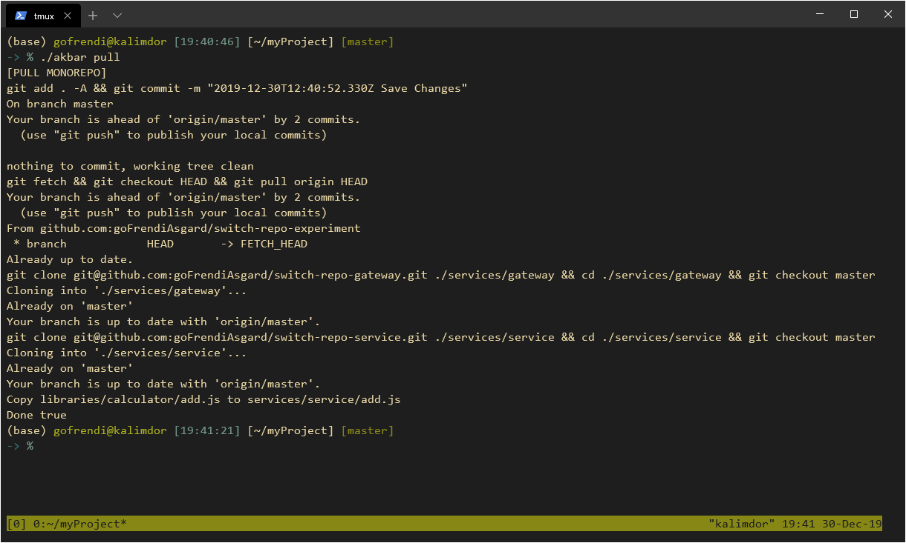
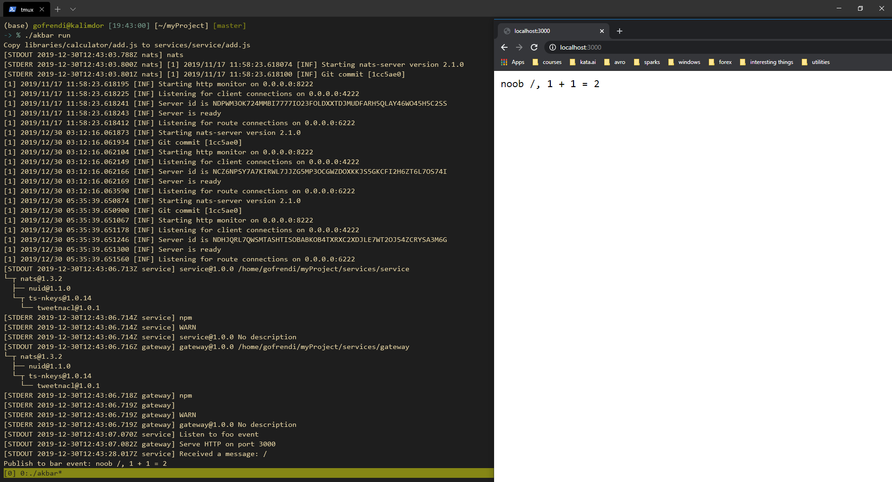
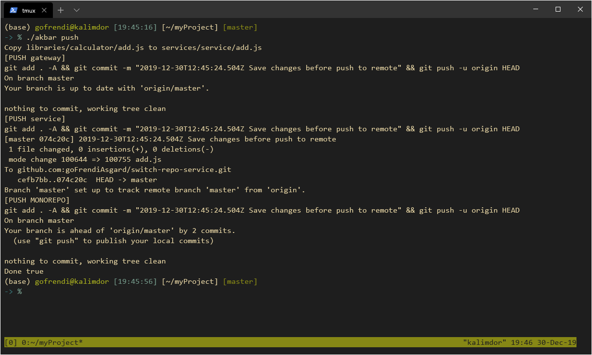

# Switch Repo (aka: Akbar)

Embrace monorepo without abandon multi-repo

```
multi-repo --> mono-repo --> multi-repo
(pull)         (coding)      (push back)
```

# Problem

You already have several repos. You know merging them into mono-repo could give you some advantages, however some of your repos are private, and some others are open-source. You cannot just mix them up into a single mono-repo.

You believe monorepo is easier to manage. You want to do code-review in a single PR, not multiple of them. But you are afraid to fully embrace mono-repo.

__TL;DR__ : You want monorepo, you don't want to abandon multi-repo, and you have a very good reason for that.

# Demo

## Clone this repo

```sh
git clone git@github.com:goFrendiAsgard/switch-repo-experiment.git ~/akbar
```

## Create an empty project

```sh
# create project
cd ~/akbar
./create ~/myProject

cd ~/myProject
```



## Add origin

After creating an empty project in your computer, you should make a remote repository on your git server and link it to your project:

```sh
git remote add origin git@github.com:<your-user>/<your-repo>.git
```

## Fork multi-repo example

Open github and fork the following repositories:

```
https://github.com/goFrendiAsgard/switch-repo-service
https://github.com/goFrendiAsgard/switch-repo-gateway
```

## Create configuration

```sh
vim ./config.json # or code ./config.json
```

At the beginning, the configuration might looks like this:

```json
{
    "environments": {
        "general": {},
        "services": {}
    },
    "components": {},
    "executions": []
}
```

Now, edit your configuration to match this:

```javascript
// WARNING: Please remove every comment in this file. JSON doesn't support comments.
{
    "environments": { // Environment shared for every services
        "general": { // General environment, shared among services
            "natsUrl": "nats://nats.io:4222",
            "getMessageEvent": "foo",
            "sendMessageEvent": "bar"
        },
        "services": {
            "gateway": { // Specific environment for `gateway` service.
                "port": 3000
            },
            "service": { // Specific environment for `service` service.
                "message": "noob"
            }
        }
    },
    "components": { // Components of this "monorepo" project
        "calculator": { // A library, we wil add this later. Can be shared among services via `service.links`
            "type": "library",
            "location": "./libraries/calculator" // physical location, relative to the project
        },
        "gateway": { // A gateway service (will be fetched from your repo). This service will listen to HTTP request, send message to NATS, waiting for reply, and show serve response.
            "type": "service",
            "origin": "git@github.com:goFrendiAsgard/switch-repo-gateway.git", // Make sure you change this one to match yours
            "branch": "master",
            "location": "./services/gateway", // physical location, relative to the project
            "start": "npm install && node start"
        },
        "service": { // Core service, This service will listen to NATS and publish response.
            "type": "service",
            "origin": "git@github.com:goFrendiAsgard/switch-repo-service.git", // Make sure you change this one to match yours
            "branch": "master",
            "location": "./services/service", // physical location, relative to the project
            "links": {
                "calculator": { // this service is depend on calculator library
                    "from": "./add.js",
                    "to": "./add.js"
                }
            },
            "start": "npm install && node start"
        },
        "nats": { // Nats docker container definition
            "type": "container",
            "run": "docker run --name nats -p 4222:4222 -p 6222:6222 -p 8222:8222 -d nats",
            "containerName": "nats"
        }
    },
    "executions": [ // The running order of the services
        "nats",
        "service",
        "gateway"
    ]
}
```

## Create library

```sh
mkdir -p ./libraries/calculator
vim ./libraries/calculator/add.js # or code ./libraries/calculator/add.js
```

```javascript
// this is the content of `add.js`
module.exports = (a, b) => a + b;
```

## Pull all

Now, eveerything is ready. Time to fetch some codes from multi-repos.

```sh
./akbar pull
```



##  Run

Finally, the most exciting thing for developers: run everything in a single screen. Running micro-services in your machine is now this easy.

```sh
./akbar run
```



## Develop

Since this is a single monorepo, you can perform any git operation here. Once you have make sure that your code works as expected, you can push all changes to every sub-repos.

## Push all

Once the development finished, you can push the changes into every sub-repos at once.

```sh
./akbar push
```


